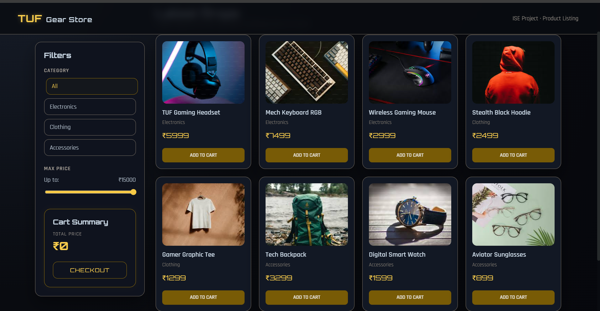

# TUF Gear Store - E-commerce Product Listing

A responsive, dark-themed e-commerce product listing page built with **HTML**, **CSS (Grid/Flexbox)**, and **Vanilla JavaScript**. This project features dynamic product rendering, real-time filtering, and a functional shopping cart system.

** Submitted for:** IntrnForte Internship (Web Development Task 1)

---

## Live Demo
**[Click Here to View the Live Project](https://shashankachar19.github.io/IntrnForte-Ecommerce-Project/)**

---

## Screenshots

###Desktop View


### Mobile Responsive
The layout automatically adjusts to a single-column stack on mobile devices for seamless browsing.

---

## Key Features
* **Dynamic Rendering:** Products are injected into the DOM via JavaScript arrays, not hardcoded.
* **Dual Filtering Logic:**
    * Filter by **Category** (Electronics, Clothing, Accessories).
    * Filter by **Price Range** using a real-time slider.
    * *Both filters work together simultaneously.*
* **Shopping Cart System:**
    * Add items to the cart instantly.
    * Live updates of the Total Price.
    * **Custom Toast Notifications** (Non-blocking popup alerts).
* **UI/UX Design:**
    * **"ASUS TUF" Aesthetic:** Dark mode with Gold accents (`#F6C945`).
    * **Animations:** Entry fade-ins, hover glow effects, and smooth transitions.
    * **Responsive:** Fully optimized for Mobile, Tablet, and Desktop using **CSS Grid**.

---

## Technical Stack
* **Frontend:** HTML5, CSS3 (Variables, Grid, Media Queries)
* **Scripting:** JavaScript (ES6+, DOM Manipulation, Higher-Order Functions)
* **Fonts:** 'Orbitron' (Headers) & 'Rajdhani' (Body) from Google Fonts.
* **Assets:** Local image optimization for offline stability.

---

## Project Structure
```bash
IntrnForte-Ecommerce-Project/
│
├── assets/          # Product images folder
├── index.html       # Main structure
├── style.css        # Styling and animations
├── script.js        # Data array and logic
└── README.md        # Project documentation
